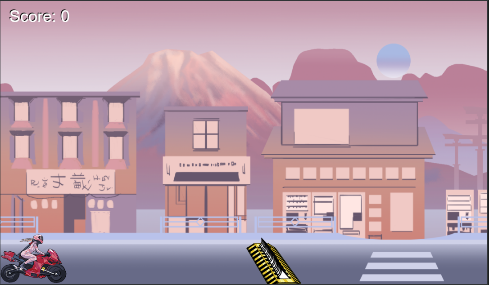

Here's a basic template for a README.md file for your Git repository that holds a browser game. You can customize it to fit your specific game and project details:

# Motorcycle Jump

## Description

Take a drive down the road of a small Japanese town, all whilest avoiding the spike strips along the way! 

## Play the Game

Include a link or instructions on how to play the game directly in the browser. If the game is hosted online, provide a live demo link.

### Controls
Use your arrow keys to move your character around and do what you must to avoid the spike strips!

## Technologies Used

All made by html, css, and mostly javascript

## Roadmap
In the future I would like to improve hitboxes, add new enemies, add new movements(including sliding to avoid enemies from above)

## Contributing
All assets were made by my ever so talented friend Wemilo Stein 

## Contact
Creator Tyler Graf Phone Number : 312-764-8365

Enjoy playing the game!
# Motorcycle Jump 
